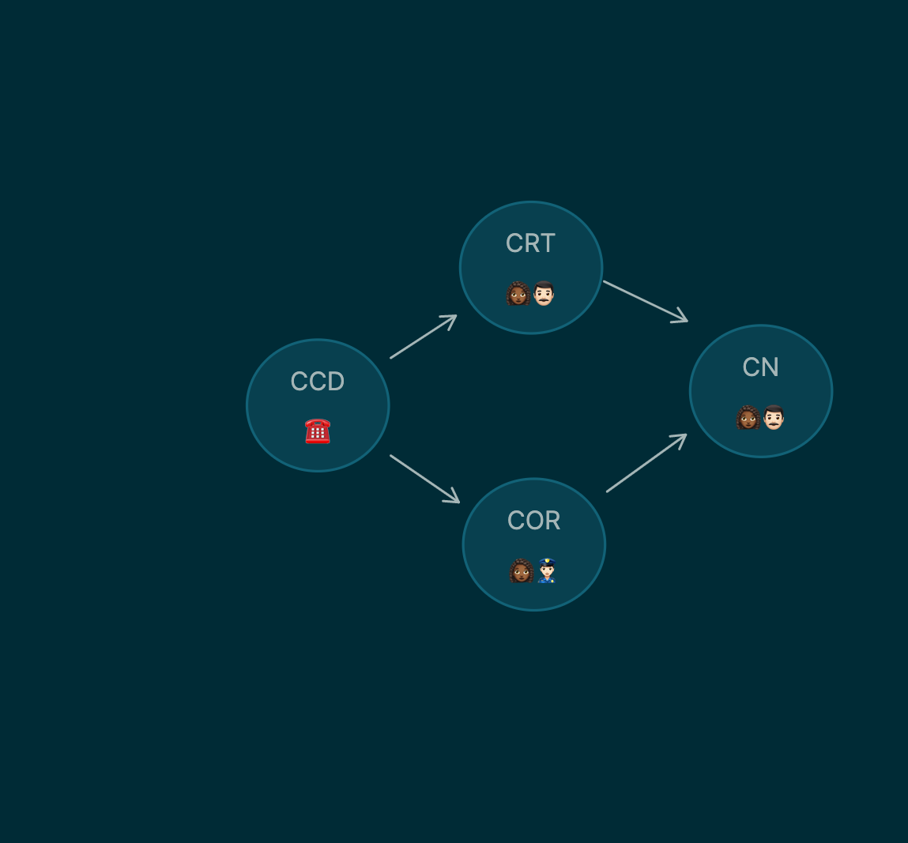

- Test paragraph before an asset
  
  
  {:width 105} tests an asset with a manual link, custom title and in a subdirectory
- {:height 288, :width 252} and {:width 335.99774169921875}
- From Inception:
  #+BEGIN_QUOTE
  Saito: Cobb? Impossible. We were young men together. I'm an old man.
  ...
  Cobb: I've come back for you... to remind you of something. Something you once knew...
  #+END_QUOTE
- > markdown quote
  [[wut]]
  line 3
- Test of various ast types:
  #+BEGIN_QUOTE
  *Italic* ~~Strikethrough~~ ^^Highlight^^ #[[foo]]
  **Learn Datalog Today** is an interactive tutorial designed to teach you the [Datomic](http://datomic.com/) dialect of [Datalog](http://en.wikipedia.org/wiki/Datalog). Datalog is a declarative **database query language** with roots in logic programming. Datalog has similar expressive power as [SQL](http://en.wikipedia.org/wiki/Sql).
  #+END_QUOTE
- test page embed
  {{embed [[page embed]]}}
- test block embed
  id:: 685434e1-0bb9-468c-a660-1642b00b2854
- {{embed ((685434e1-0bb9-468c-a660-1642b00b2854))}}