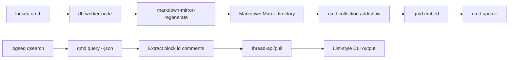

# QMD Search CLI Implementation Plan

## Goal

Add `logseq qmd` and `logseq qsearch` so CLI users can search DB graph Markdown Mirror files through QMD and map search hits back to Logseq block entities.

## Architecture

- Keep the QMD integration in the CLI process.
- Call `qmd` as an external executable through Node child process APIs with argument vectors.
- Reuse db-worker-node startup and transport helpers.
- Reuse the existing `:thread-api/markdown-mirror-regenerate` API for mirror generation.
- Reuse the existing `:thread-api/pull` API for entity lookup.
- Do not add a new thread API for this feature.

## Public Interface

`logseq qmd [--graph <graph>]`

- Verify that `qmd` is executable.
- Regenerate Markdown Mirror for the selected graph.
- Resolve the mirror directory as `<root-dir>/graphs/<encoded-repo>/mirror/markdown`.
- Use the deterministic graph collection name computed by the Logseq CLI.
- Initialize the QMD collection with `qmd collection add <mirror-dir> --name <collection> --mask "**/*.md"`.
- If the collection already points at the same mirror directory, reuse it.
- If the collection name points at a different path, fail fast.
- Run `qmd embed`.
- Run `qmd update`.

`logseq qsearch <query> --graph <graph> [-n <limit>] [--no-rerank]`

- Run `qmd query <query> --json -c <collection> -n <limit>`.
- Use the same deterministic graph collection name as `logseq qmd`.
- Parse noisy QMD stdout defensively.
- Extract block ids from Markdown Mirror comments matching `<!-- id: 123 -->`.
- Pull entities through `:thread-api/pull`.
- Deduplicate ids in QMD rank order.
- Return Logseq list-style output plus `missing-ids` for stale QMD results.

Collection names are internal and use `logseq-<graph-slug>-<repo-hash8>` to avoid collisions between graphs with similar display names. The CLI uses QMD's default index and does not expose manual collection or index options.

## Data Flow

## Implementation Tasks

- Add `src/main/logseq/cli/command/qmd.cljs` for command entries, action builders, QMD process execution, collection initialization, QMD JSON parsing, id extraction, and qsearch normalization.
- Wire `qmd` and `qsearch` into `src/main/logseq/cli/commands.cljs`.
- Show `qmd` in utility help and `qsearch` in graph inspect/search help.
- Format `:qmd` and `:qsearch` in `src/main/logseq/cli/format.cljs` for human, JSON, and EDN output.
- Add unit tests for command entries, graph requirements, default collection names, mirror path derivation, QMD executable checks, collection create/update/mismatch handling, noisy JSON parsing, block id extraction, dedupe order, missing ids, and entity pull calls.
- Add parser tests for `qmd`, `qsearch`, help output, positional query handling, and invalid option behavior.
- Add format tests for human table output and JSON/EDN payload stability.
- Add a CLI E2E case with a fake `qmd` executable on `PATH` so the test does not depend on local QMD models, embeddings, or network access.

## Verification

- Run focused unit tests for `logseq.cli.command.qmd-test`, `logseq.cli.commands-test/test-qmd-and-qsearch-parse`, and qsearch/qmd format tests.
- Run `bb dev:lint-and-test`.
- Run `bb -f cli-e2e/bb.edn build`.
- Run `bb -f cli-e2e/bb.edn test --skip-build`.
- Review the finished diff with `logseq-review-workflow`, applying common, Clojure/CLJS, promesa/Node process, babashka CLI, shadow-cljs Node, logseq-cli, and search-indexing rules.
